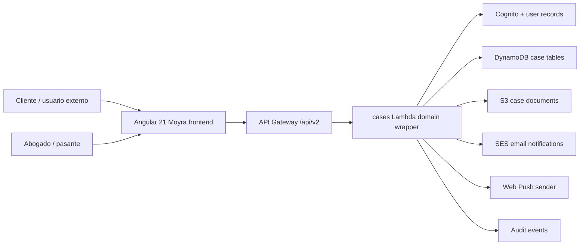
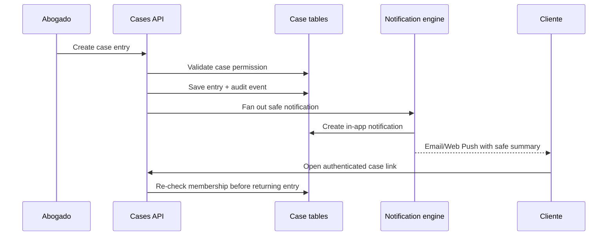

# Plan: Moyra Client Cases Portal

**Generated**: 2026-06-18 19:23:01 -06:00 CT  
**Estimated Complexity**: High  
**Spec Source**: `docs/superpowers/specs/2026-06-18-moyra-client-cases-portal-design.md`

## Overview

Build a new private **Casos** module for Moyra where clients can sign in, see only the cases they are authorized to access, receive case updates, comment, upload documents, and get notifications. This feature must not change the public Publications section, public publication routes, SEO behavior, or public content APIs.

Implementation should happen backend-first because the feature handles confidential legal communication. The first runnable increments must establish private data storage, server-side authorization, and auditable case actions before the Angular UI exposes workflows.

Planning vocabulary:

- **Spec phases** are the five product/release phases in the design spec.
- **Implementation sprints** are smaller executable slices used to build those phases safely.
- Sprints do not replace the five phases; they decompose them into testable increments.
- Current mapping: Phase 1 = Sprints 0-3, Phase 2 = Sprints 5-6, Phase 3 = Sprint 7, Phase 4 = Sprints 4 and 8, Phase 5 = Sprint 9.
- Sprint 8 was completed on 2026-06-19 00:41 CT: notification preferences UI, Angular service worker/Web Push opt-in flow, safe email template rendering, and backend Web Push sender via `web-push@3.6.7` are implemented behind disabled-by-default flags.
- Sprint 9 was completed on 2026-06-19 01:11 CT as release-readiness hardening: route privacy regression tests, public aggregate leakage tests, release/rollback runbook, full automated validation, and dependency audit cleanup. Controlled test deployment, real-browser visual QA, SES activation, Web Push secret activation, and client-upload malware scanning remain explicit release gates.

Approved direction:

- Use a new Cases domain model, not visibility flags on public Publications.
- Reuse editor, file, list, and content presentation patterns where useful.
- Keep public `/publications` and `/publication/:id` unchanged.
- Case entries have no SEO fields and no unauthenticated routes.
- External clients can belong to multiple cases.
- Each case can have multiple external participants and multiple internal participants.
- Attorneys configure case statuses and simple flows in MVP.
- Pasantes/internal collaborators are handled through per-case permissions and presets.
- Client uploads become visible to the internal team immediately, but external visibility requires attorney approval or confirmation.
- MVP notifications include in-app notification center, email, and browser Web Push.
- Native mobile notifications are designed for later extension, not required in MVP.
- Frontend target is Angular 21 because current NgRx packages resolve to `21.1.1` with Angular peer dependency `^21.0.0`.

## Architecture Snapshot

## Current Evidence To Preserve

- Frontend repo currently uses Angular `20.3.x` and NgRx `20.1.x`.
- Current `npm view @ngrx/store version peerDependencies --json` returned version `21.1.1` with peer `@angular/core: ^21.0.0`.
- Current `npm view @ngrx/effects version peerDependencies --json` returned version `21.1.1` with peer `@angular/core: ^21.0.0` and `@ngrx/store: 21.1.1`.
- Current `npm view @ngrx/signals version peerDependencies --json` returned version `21.1.1` with peer `@angular/core: ^21.0.0`.
- Current `npm view @ngrx/store-devtools version peerDependencies --json` returned version `21.1.1` with peer `@angular/core: ^21.0.0` and `@ngrx/store: 21.1.1`.
- Context7 Angular docs confirmed `SwPush.requestSubscription({ serverPublicKey })`, `messages`, `notificationClicks`, `subscription`, and `isEnabled`.
- Context7 NgRx docs confirmed v21 migration via `ng update @ngrx/store@21` and SignalStore async flows through `rxMethod`.
- Context7 AWS SDK v3 docs confirmed SES `SendEmailCommand`/`SendEmail` requires sender, destination, message content, and returns `MessageId`.
- Sprint 3 implementation kept Moyra's existing S3 signed PUT upload pattern instead of adding `createPresignedPost`; the API returns upload `url`, `method`, headers, and configurable expiration.

## Prerequisites

- Work in two repos:
  - Frontend: `C:\Users\lince\Documents\GitHub\moyra-front-angular`
  - Backend/infra: `C:\Users\lince\Documents\GitHub\moyra-infra-serverless`
- Before backend edits, review and preserve any dirty work in `moyra-infra-serverless`. Prior inspection showed unrelated dirty files there; do not overwrite them.
- Keep the existing promotion shape: test first, then production after verified smoke checks.
- Keep the existing API route split and rollback posture. The monolith backup remains a rollback target; new case routes should be added through the domain Lambda split, not by collapsing routes back into the monolith.
- Confirm SES DNS later before enabling production email. The code can support SES behind a feature flag before DNS is final.
- Do not add AWS WAF in this feature without explicit approval. If abuse protection is needed, start with application checks, throttling decisions, CloudWatch alarms, and a cost discussion.
- Use short, safe notification summaries. Email and push must not include confidential legal details, full comments, document contents, or sensitive filenames unless explicitly approved later.

## Sprint 0: Implementation Setup And Contract Freeze

**Goal**: Prepare the work without changing runtime behavior. Freeze the API and data contracts that backend and frontend will implement.

**Demo/Validation**:

- Plan, spec, and API contract are linked from repo docs.
- Frontend and backend branches/worktrees are known and clean or intentionally dirty.
- Angular 21 and NgRx 21 compatibility is rechecked before package updates.

### Task 0.1: Create Implementation Branches

- **Location**:
  - `C:\Users\lince\Documents\GitHub\moyra-front-angular`
  - `C:\Users\lince\Documents\GitHub\moyra-infra-serverless`
- **Description**: Create implementation branches with `codex/` prefix, after checking status in each repo.
- **Dependencies**: None.
- **Acceptance Criteria**:
  - Each repo has a branch dedicated to the Cases portal work.
  - Existing user changes are not reverted or overwritten.
- **Validation**:
  - `git status --short`
  - `git branch --show-current`

### Task 0.2: Add API Contract Document

- **Location**:
  - Frontend docs: `docs/superpowers/contracts/moyra-client-cases-api.md`
  - Backend docs mirror if useful: `docs/client-cases-api.md`
- **Description**: Document route shapes, request/response bodies, status codes, permission names, and error envelopes before implementation.
- **Dependencies**: Approved spec.
- **Acceptance Criteria**:
  - Contract includes routes for case types, cases, members, entries, comments, file upload approval, notifications, and push subscriptions.
  - Contract explicitly states that public Publications APIs do not expose case data.
  - Contract defines deny-by-default behavior for missing membership or permissions.
- **Validation**:
  - Review contract against the approved spec.
  - Placeholder scan: no unresolved markers or dummy endpoints left in accepted contract sections.

### Task 0.3: Define Feature Flags And Environment Matrix

- **Location**:
  - Backend CDK/env documentation in `moyra-infra-serverless`
  - Frontend environment/service documentation in `moyra-front-angular`
- **Description**: Define feature flags for progressive rollout.
- **Dependencies**: Task 0.2.
- **Acceptance Criteria**:
  - Proposed flags include:
    - `CASES_FEATURE_ENABLED`
    - `CASE_EMAIL_NOTIFICATIONS_ENABLED`
    - `CASE_WEB_PUSH_ENABLED`
    - `CASE_CLIENT_UPLOADS_ENABLED`
  - Test and production defaults are documented.
  - Disabled flags fail closed for private data.
- **Validation**:
  - Contract review confirms every new UI entry point can be hidden while backend denies access.

### Task 0.4: Recheck Angular And NgRx Version Ceiling

- **Location**: `package.json`, `package-lock.json`
- **Description**: Before upgrading, re-run npm version checks for Angular/NgRx. If NgRx still targets Angular 21, upgrade only to Angular 21.
- **Dependencies**: None.
- **Acceptance Criteria**:
  - Package update decision is written in the implementation notes.
  - If NgRx publishes Angular 22-compatible packages later, that upgrade is split into a separate decision.
- **Validation**:
  - `npm view @ngrx/store version peerDependencies --json`
  - `npm view @ngrx/effects version peerDependencies --json`
  - `npm view @ngrx/signals version peerDependencies --json`
  - `npm view @ngrx/store-devtools version peerDependencies --json`

## Sprint 1: Backend Infrastructure And Route Shell

**Goal**: Add private case data infrastructure and API route plumbing without implementing full business workflows.

**Demo/Validation**:

- CDK synth passes.
- Route families exist behind authenticated handlers.
- New tables and IAM permissions appear in synthesized infrastructure.
- Public Publications routes remain unchanged.

### Task 1.1: Add Case DynamoDB Tables

- **Location**: `C:\Users\lince\Documents\GitHub\moyra-infra-serverless\infra\lib\moyra-cloud-stack.js`
- **Description**: Add DynamoDB tables following the repo's existing table factory style.
- **Dependencies**: Task 0.2.
- **Acceptance Criteria**:
  - Tables are defined for:
    - `case-types`
    - `cases`
    - `case-memberships`
    - `case-entries`
    - `case-comments`
    - `case-files`
    - `case-notifications`
    - `case-push-subscriptions`
    - `case-audit-events`
  - Indexes support normal access paths without scans:
    - memberships by `userId`, `caseId`, and `email`
    - entries by `caseId` and creation time
    - comments by `caseId`/`entryId` and creation time
    - files by `caseId`, uploader, and visibility status
    - notifications by recipient and read/unread status
    - audit events by `caseId` and timestamp
- **Validation**:
  - CDK unit tests assert table names and required GSIs.
  - `npm test` or targeted CDK tests in backend repo.

### Task 1.2: Add Cases Lambda Domain Wrapper

- **Location**:
  - `C:\Users\lince\Documents\GitHub\moyra-infra-serverless\infra\lambda\api\cases.js`
  - `C:\Users\lince\Documents\GitHub\moyra-infra-serverless\infra\lib\moyra-cloud-stack.js`
- **Description**: Add a dedicated route-family Lambda wrapper for private Cases APIs, matching the current split-domain Lambda approach.
- **Dependencies**: Task 1.1.
- **Acceptance Criteria**:
  - Cases routes are handled by a new domain wrapper, not public-site or admin-content wrappers.
  - New environment variables pass table names, bucket names, and feature flags.
  - Existing monolith rollback function remains deployed.
- **Validation**:
  - CDK tests assert cases routes integrate with the cases Lambda.
  - API Gateway route list tests or snapshots include new `/api/v2/cases...` routes.

### Task 1.3: Add Least-Privilege IAM For Cases Domain

- **Location**: `C:\Users\lince\Documents\GitHub\moyra-infra-serverless\infra\lib\moyra-cloud-stack.js`
- **Description**: Grant the cases Lambda access only to needed tables, S3 prefixes, Cognito admin actions required for invites, and SES actions only when email is enabled.
- **Dependencies**: Tasks 1.1, 1.2.
- **Acceptance Criteria**:
  - Cases Lambda does not receive broad access to unrelated content tables.
  - SES permissions are scoped to required sending actions and configured identity when known.
  - S3 permissions are scoped to case document prefixes.
- **Validation**:
  - CDK template assertions for IAM actions/resources.
  - Manual review of synthesized IAM diff.

### Task 1.4: Add Backend Route Smoke Tests

- **Location**:
  - `C:\Users\lince\Documents\GitHub\moyra-infra-serverless\test\apiLambda.test.js`
  - `C:\Users\lince\Documents\GitHub\moyra-infra-serverless\test\cdkStack.test.js`
- **Description**: Add tests that prove unauthenticated case route access fails and public Publications still work.
- **Dependencies**: Tasks 1.2, 1.3.
- **Acceptance Criteria**:
  - Unauthenticated `/api/v2/cases` returns 401/403.
  - Public `/api/v2/publications` behavior is unchanged in existing tests.
  - Admin-only routes remain unaffected.
- **Validation**:
  - `node --test --test-force-exit test/apiLambda.test.js`
  - `node --test --test-force-exit test/cdkStack.test.js`

## Sprint 2: Case Authorization And Core Domain API

**Goal**: Implement deny-by-default authorization and core CRUD workflows for cases, case types, statuses, members, entries, and comments.

**Demo/Validation**:

- Admin can create a case and attach members through API tests.
- A client user can list only their assigned cases.
- A user cannot read, comment, upload, or receive entry details for a case without membership.

### Task 2.1: Implement Case Principal Resolution

- **Location**: `C:\Users\lince\Documents\GitHub\moyra-infra-serverless\infra\lambda\api\index.js` or extracted cases domain module
- **Description**: Resolve authenticated user identity from existing JWT/Cognito claims and user records.
- **Dependencies**: Sprint 1.
- **Acceptance Criteria**:
  - Admin users retain current admin authorization behavior.
  - External clients do not need admin claims; case access comes from `case-memberships`.
  - Missing or inconsistent user records fail closed.
- **Validation**:
  - Unit tests for admin, client member, client non-member, and expired/missing token.

### Task 2.2: Implement `requireCasePermission`

- **Location**: Cases domain module in backend repo
- **Description**: Add one authorization gate used by every case read/write/comment/upload/download/notification action.
- **Dependencies**: Task 2.1.
- **Acceptance Criteria**:
  - Permissions include at minimum:
    - `case.read`
    - `case.write_entry`
    - `case.comment`
    - `case.upload_file`
    - `case.approve_file_visibility`
    - `case.manage_members`
    - `case.manage_status`
    - `case.manage_permissions`
  - Permission decisions are based on case membership, internal/admin status, and per-case role presets.
  - No endpoint trusts frontend-provided role names.
- **Validation**:
  - Unit tests cover each permission.
  - Negative tests prove forged payload role fields do not grant access.

### Task 2.3: Implement Case Types And Configurable Statuses

- **Location**: Cases API module and Dynamo table helpers
- **Description**: Add CRUD endpoints for case types and ordered statuses managed by attorneys/admins.
- **Dependencies**: Task 2.2.
- **Acceptance Criteria**:
  - Attorneys/admins can define status label, color, order, active flag, and optional default status.
  - Cases reference a case type and current status by ID.
  - Status changes create audit events.
  - MVP does not enforce strict transitions; future workflow constraints can be added later.
- **Validation**:
  - API tests for create/update/reorder/deactivate status.
  - Audit event tests for status changes.

### Task 2.4: Implement Cases And Memberships API

- **Location**: Cases API module
- **Description**: Add endpoints for case lifecycle and participant management.
- **Dependencies**: Tasks 2.2, 2.3.
- **Acceptance Criteria**:
  - Internal user can create/update/archive a case.
  - Internal user can add/remove/update members.
  - Member record supports:
    - `userId`
    - `email`
    - display name
    - party/client grouping
    - role preset
    - granular permission overrides
    - active/invited/removed status
  - Client listing endpoint returns only cases where the requester is an active member.
- **Validation**:
  - API tests for member query by user ID and email.
  - API tests for removed member losing access immediately.

### Task 2.5: Implement Entries And Comments API

- **Location**: Cases API module
- **Description**: Add private publication-like case entries and threaded comments.
- **Dependencies**: Task 2.4.
- **Acceptance Criteria**:
  - Case entries support rich text, safe insertions, attachments references, author, visibility scope, and created/updated timestamps.
  - Case entries do not include SEO fields, slug fields, public URL title fields, or public feed flags.
  - Comments are immediately visible within entry/case visibility scope.
  - Comment create/update/delete actions are audited.
- **Validation**:
  - API tests prove entries never appear in `/api/v2/publications` or `/api/v2/site`.
  - API tests prove non-member cannot read entry/comments by guessed ID.

## Sprint 3: Files, Invites, And Audit Trail

**Goal**: Support client document uploads, internal review/approval for external visibility, email invitations, and auditable security history.

**Demo/Validation**:

- Client can request an upload URL for an assigned case.
- Internal team can see the uploaded file record immediately.
- Other external members cannot see the file until approval.
- Invited user can be associated with a case before first login.

### Task 3.1: Add Case File Upload API

- **Location**:
  - Backend cases module
  - Existing files/S3 helper area if reusable
- **Description**: Add case-scoped upload initialization using the existing S3 presigned PUT upload pattern.
- **Dependencies**: Sprint 2.
- **Acceptance Criteria**:
  - Upload keys are scoped under a case-specific prefix.
  - Presigned upload URL has short expiration.
  - File metadata record is created with uploader, case ID, size, MIME type, and visibility state.
  - Client uploads default to `internal_visible` and `external_pending`.
  - Size and MIME restrictions are enforced server-side.
- **Validation**:
  - API tests for upload init permissions.
  - API tests for blocked oversize/unsupported file requests.
  - S3 key prefix tests prevent path traversal or cross-case keys.

### Task 3.2: Add File Visibility Approval Workflow

- **Location**: Backend cases module
- **Description**: Add endpoints for attorney/internal approval of external file visibility.
- **Dependencies**: Task 3.1.
- **Acceptance Criteria**:
  - Internal team can approve, reject, or restrict external visibility.
  - Approval can target all external case members or selected members/parties.
  - Every visibility change writes audit event.
  - Download endpoint checks permission and file visibility at request time.
- **Validation**:
  - API tests for internal visibility, external pending denial, approved external access, and removed-member denial.

### Task 3.3: Add Case Invite Flow

- **Location**:
  - Backend cases module
  - Existing auth/user service helpers
- **Description**: Allow Moyra internal users to invite clients or collaborators from a case.
- **Dependencies**: Task 2.4.
- **Acceptance Criteria**:
  - If user exists, membership is linked.
  - If user does not exist, create/initiate account through Cognito-compatible flow and create pending membership.
  - Invite token/link does not expose case details before authentication.
  - Invite state is visible in membership list.
- **Validation**:
  - API tests for existing user invite, new user invite, duplicate invite, and removed invite.
  - Security test verifies unauthenticated invite URL reveals no case data.

### Task 3.4: Add Audit Event Coverage

- **Location**: Backend cases module and tests
- **Description**: Centralize audit writes for sensitive case actions.
- **Dependencies**: Sprints 2 and 3 tasks.
- **Acceptance Criteria**:
  - Audit events cover case create/update/archive, member changes, permission changes, status changes, entry changes, comment changes, file upload/init/download/approval, invite creation, notification preference changes.
  - Audit records include actor, action, case ID, target type/ID, timestamp, and request correlation ID when available.
  - Audit API is internal-only.
- **Validation**:
  - Unit tests assert audit write on each sensitive mutation.
  - Non-admin/client access to audit API is denied.

## Sprint 4: Notification Backend

**Goal**: Deliver safe case notifications through in-app records, SES email, and Web Push-ready subscription handling.

**Demo/Validation**:

- Creating a case entry/comment/file approval creates in-app notifications.
- Email send is available behind a disabled-by-default production flag until SES DNS is confirmed.
- Web Push subscription storage works behind a disabled-by-default flag. Actual Web Push sending waits for Sprint 8 service worker/UI integration.

### Task 4.1: Implement Notification Events And Fanout

- **Location**: Backend cases/notifications module
- **Description**: Create a notification service that receives domain events and resolves recipients from active case memberships.
- **Dependencies**: Sprint 2.
- **Acceptance Criteria**:
  - Notification record includes recipient, case ID, event type, safe title/body, link target, read timestamp, delivery statuses, and dedupe key.
  - Recipients exclude the actor when appropriate.
  - Removed/inactive members are excluded.
  - Dedupe prevents duplicate notification spam on retries.
- **Validation**:
  - Unit tests for fanout, dedupe, inactive member exclusion, actor exclusion.

### Task 4.2: Implement In-App Notification API

- **Location**: Backend cases/notifications module
- **Description**: Add endpoints for listing notifications, marking one/all read, and getting unread count.
- **Dependencies**: Task 4.1.
- **Acceptance Criteria**:
  - Client sees only own notifications.
  - Internal users see own notifications, not a global inbox unless an admin endpoint is explicitly used.
  - Mark-read is idempotent.
- **Validation**:
  - API tests for unread count, mark read, cross-user denial.

### Task 4.3: Implement SES Email Sender Behind Flag

- **Location**:
  - Backend notification sender module
  - CDK env/IAM for SES
- **Description**: Add SES email delivery using AWS SDK v3, but keep production sending gated until sender domain/subdomain and DNS are confirmed.
- **Dependencies**: Task 4.1.
- **Acceptance Criteria**:
  - Uses configured sender identity and reply-to.
  - Stores SES `MessageId` or failure reason in notification delivery status.
  - Email content includes safe summary and authenticated link only.
  - Email sending can be disabled without affecting in-app notification creation.
- **Validation**:
  - Unit tests mock SES success/failure.
  - Test environment manual smoke with SES sandbox or verified recipient when configured.

### Task 4.4: Implement Web Push Subscription API

- **Location**:
  - Backend notification module
  - Frontend notification service in Sprint 5/8
- **Description**: Add storage and management for browser push subscriptions. `npm view web-push version` returned `3.6.7` during Sprint 4 and `web-push` remains the selected VAPID-compatible sender candidate for Sprint 8, when Angular service worker integration exists.
- **Dependencies**: Task 4.1.
- **Acceptance Criteria**:
  - Authenticated user can register, list current, and delete own push subscription.
  - Subscription endpoint/key material is stored only for the authenticated owner and is omitted from API responses.
  - In-app notification delivery records mark Web Push as `skipped/not_implemented` until Sprint 8 sender work.
  - Future push payloads must include safe summary only.
  - Expired/failed subscriptions are disabled after send failure once the sender is implemented.
- **Validation**:
  - API tests for register/delete/cross-user denial.
  - Sender tests for success, gone/expired subscription, and retryable failure move to Sprint 8 with the sender implementation.

## Sprint 5: Angular 21 Upgrade And Frontend Foundation

**Goal**: Upgrade frontend baseline to Angular 21, preserve current public/admin behavior, and add the Cases frontend foundation without full UI workflows.

**Demo/Validation**:

- Existing Moyra frontend builds and tests on Angular 21.
- Existing public Publications and admin routes still render.
- Cases routes exist behind auth and feature flags.

### Task 5.1: Upgrade Angular And NgRx To 21

- **Location**:
  - `package.json`
  - `package-lock.json`
  - Angular config files if migration changes them
- **Description**: Run Angular and NgRx migrations to v21.
- **Dependencies**: Task 0.4.
- **Acceptance Criteria**:
  - Angular packages are v21-compatible.
  - NgRx packages are aligned to `21.1.1` or the latest v21-compatible version confirmed at implementation time.
  - No Angular 22 packages are introduced unless NgRx peer dependencies support them.
- **Validation**:
  - `npx ng update @angular/core@21 @angular/cli@21`
  - `npx ng update @ngrx/store@21`
  - `npm install`
  - `npm run build`
  - `npx ng test --watch=false --browsers=ChromeHeadless --no-progress`

### Task 5.2: Add Case Models

- **Location**: `C:\Users\lince\Documents\GitHub\moyra-front-angular\src\app\models\case.ts`
- **Description**: Add TypeScript interfaces matching the approved API contract.
- **Dependencies**: Task 0.2.
- **Acceptance Criteria**:
  - Models cover case type, status, case, membership, permissions, entry, comment, file, notification, and push subscription DTOs.
  - No SEO/public publication model fields are included in case entries.
- **Validation**:
  - TypeScript compile through `npm run build`.
  - Unit tests for DTO mapping if service transforms API data.

### Task 5.3: Add Cases API Service

- **Location**: `C:\Users\lince\Documents\GitHub\moyra-front-angular\src\app\services\case.service.ts`
- **Description**: Add a focused Angular service for Cases APIs using the existing global API base and auth patterns.
- **Dependencies**: Task 5.2.
- **Acceptance Criteria**:
  - Service methods map one-to-one to the API contract.
  - Service uses existing authenticated request conventions.
  - Service exposes typed observables/promises consistently with repo style.
- **Validation**:
  - Unit tests mock HTTP calls and verify URLs, methods, auth, and request bodies.

### Task 5.4: Add Cases Feature Store Strategy

- **Location**:
  - `src/app/store/auth/` remains unchanged except integration points if needed.
  - New local feature store path only if implementation needs it, such as `src/app/store/cases/` or component-scoped SignalStore.
- **Description**: Keep global NgRx for auth; use service + component state for simple screens, and NgRx SignalStore only where it reduces loading/filtering complexity.
- **Dependencies**: Tasks 5.1, 5.3.
- **Acceptance Criteria**:
  - Existing auth store is not rewritten.
  - Cases does not add broad global state without a real workflow need.
  - If SignalStore is used, async methods follow v21 `rxMethod` patterns.
- **Validation**:
  - Component/service tests cover loading, error, and empty states.

### Task 5.5: Add Case Routes And Guards

- **Location**:
  - `src/app/app.routes.ts`
  - `src/app/admin/admin-routing.module.ts`
  - new client feature components under `src/app/components/cases/`
  - new admin feature components under `src/app/admin/cases/` or flat admin files if matching repo style is preferred
- **Description**: Add route shells behind feature flags and auth guards.
- **Dependencies**: Tasks 5.2, 5.3.
- **Acceptance Criteria**:
  - Client routes:
    - `/casos`
    - `/casos/:caseId`
    - `/casos/:caseId/entrada/:entryId`
  - Admin/internal routes:
    - `/admin/casos`
    - `/admin/casos/:caseId`
    - `/admin/casos/configuracion`
  - Disabled feature flag hides navigation and blocks route access.
  - Route guard does not rely on localStorage-only identity.
- **Validation**:
  - Router tests for allowed/blocked routes.
  - Existing route tests still pass.

## Sprint 6: Internal Case Management UI

**Goal**: Let Moyra internal users manage cases, statuses, participants, permissions, entries, files, and audit views.

**Demo/Validation**:

- Admin/internal user can create a case, choose configurable status, invite a client, publish a private entry, approve file visibility, and view audit history.

### Task 6.1: Add Admin Cases List

- **Location**: `src/app/admin/cases/` or matching admin component structure
- **Description**: Build dense, legal-ops style list for internal case scanning.
- **Dependencies**: Sprint 5.
- **Acceptance Criteria**:
  - Filters by status, case type, member/client, and updated date.
  - Shows unread/activity indicators.
  - Empty and error states are actionable.
  - UI follows Moyra rectilinear style; no rounded-card marketing layout.
- **Validation**:
  - Component tests for filters/loading/empty/error states.
  - Browser QA at desktop and mobile widths.

### Task 6.2: Add Admin Case Detail Workspace

- **Location**: `src/app/admin/cases/`
- **Description**: Build case workspace with tabs/sections for timeline, entries, comments, files, members, permissions, status, and audit.
- **Dependencies**: Task 6.1.
- **Acceptance Criteria**:
  - Internal user can update case metadata and status.
  - Internal user can create rich text entries using existing editor patterns.
  - Internal user can comment on entries.
  - UI clearly distinguishes internal-only vs external-visible content.
- **Validation**:
  - Component tests for entry creation and status update.
  - Manual browser QA confirms no overlapping text at desktop/mobile.

### Task 6.3: Add Members And Permissions Management

- **Location**: `src/app/admin/cases/`
- **Description**: Add UI for inviting clients/collaborators and assigning per-case role presets/permissions.
- **Dependencies**: Sprint 3 API.
- **Acceptance Criteria**:
  - Internal user can invite by email from case.
  - Internal user can assign presets such as attorney, pasante, client, observer.
  - Granular permissions are visible and editable for authorized internal users.
  - Removed members are clearly inactive and lose access server-side.
- **Validation**:
  - Component tests for invite states and permission updates.
  - API integration smoke with test users.

### Task 6.4: Add File Review UI

- **Location**: `src/app/admin/cases/`
- **Description**: Add internal workflow for reviewing client uploads and approving external visibility.
- **Dependencies**: Sprint 3 API.
- **Acceptance Criteria**:
  - Internal user sees pending client uploads.
  - Internal user can approve/restrict/reject external visibility.
  - UI displays current visibility scope.
  - Download actions use authenticated API links, not raw public S3 URLs.
- **Validation**:
  - Component tests for visibility transitions.
  - Manual smoke verifies external user cannot see pending file before approval.

## Sprint 7: Client Portal UI

**Goal**: Provide the client-facing Cases portal for assigned cases, entries, comments, documents, and notification center.

**Demo/Validation**:

- Client logs in, sees only assigned cases, opens a case, reads updates, comments, uploads a document, and manages notifications.

### Task 7.1: Add Client Cases List

- **Location**: `src/app/components/cases/`
- **Description**: Build `/casos` with assigned cases only.
- **Dependencies**: Sprint 5 and backend list API.
- **Acceptance Criteria**:
  - Lists only cases returned by authenticated API.
  - Supports empty state for no assigned cases.
  - Shows status, last update, unread count, and next useful action.
- **Validation**:
  - Component tests for loaded/empty/error states.
  - API security tests remain the source of truth for access.

### Task 7.2: Add Client Case Detail

- **Location**: `src/app/components/cases/`
- **Description**: Build case timeline/detail for client members.
- **Dependencies**: Task 7.1.
- **Acceptance Criteria**:
  - Client can read authorized entries and comments.
  - Client cannot see internal-only notes or pending external files.
  - Detail view works for clients with multiple cases.
  - Navigation never exposes public SEO URLs for case entries.
- **Validation**:
  - Component tests for visibility scopes.
  - Manual browser QA with a multi-case client account.

### Task 7.3: Add Client Comments

- **Location**: `src/app/components/cases/`
- **Description**: Let clients comment where they have permission.
- **Dependencies**: Task 7.2.
- **Acceptance Criteria**:
  - Comment form handles loading, failure, and retry.
  - Comments appear immediately after successful API response.
  - Disabled state clearly appears when user lacks permission.
- **Validation**:
  - Component tests for success/error/permission-denied.
  - API negative tests for client without permission.

### Task 7.4: Add Client Document Upload

- **Location**: `src/app/components/cases/`
- **Description**: Let clients upload case documents through presigned PUT and record confirmation.
- **Dependencies**: Sprint 3 API.
- **Acceptance Criteria**:
  - Client sees upload progress and clear success/error states.
  - Upload respects allowed size/type from backend config.
  - Uploaded file appears as submitted/internal-review state.
  - Raw S3 paths are not shown as public links.
- **Validation**:
  - Component tests for upload state machine.
  - Manual smoke with allowed and blocked file types.

### Task 7.5: Add Notification Center

- **Location**: shared header/nav area and `src/app/components/cases/` or `src/app/components/notifications/`
- **Description**: Add in-app notification center for internal and client users.
- **Dependencies**: Sprint 4 API.
- **Acceptance Criteria**:
  - Header shows unread count when authenticated.
  - Notification list supports mark-read and link-to-case actions.
  - Links route to authenticated case views and re-check permissions.
  - Logged-out users do not see private notification data.
- **Validation**:
  - Component tests for unread count and mark-read.
  - Router tests for authenticated links.

## Sprint 8: Email And Web Push Frontend Integration

**Goal**: Connect user notification preferences, SES-backed email status, and browser Web Push subscription flows.

**Demo/Validation**:

- User can enable/disable notification preferences.
- Browser prompts for Web Push permission only from a deliberate user action.
- Push click routes to authenticated case view.

### Task 8.1: Add Notification Preferences UI

- **Location**: likely user/account or Cases notification settings component
- **Description**: Let users manage email and Web Push preferences for case notifications.
- **Dependencies**: Sprint 4 API.
- **Acceptance Criteria**:
  - User can opt in/out of email categories where supported.
  - User can enable/disable browser push.
  - Preferences are saved server-side.
  - UI explains unavailable channels without exposing implementation details.
- **Validation**:
  - Component tests for preference save failure/success.

### Task 8.2: Add Angular Service Worker Support For Web Push

- **Location**:
  - `angular.json`
  - `ngsw-config.json`
  - app config/service worker registration files
  - notification service/component files
- **Description**: Enable Angular service worker and integrate `SwPush`.
- **Dependencies**: Task 8.1 and production/test service worker readiness.
- **Acceptance Criteria**:
  - Service worker is enabled only where appropriate for deployment.
  - `SwPush.isEnabled` is checked before showing push controls.
  - `requestSubscription({ serverPublicKey })` is called only after user action.
  - `notificationClicks` route to authenticated case links.
- **Validation**:
  - Production-like browser smoke, because service workers do not behave fully in normal dev server mode.
  - Unit tests mock `SwPush` enabled/disabled states.

### Task 8.3: Add Safe Email Template Rendering

- **Location**: backend notification sender/templates
- **Description**: Create safe text/HTML email templates for case notifications.
- **Dependencies**: Task 4.3.
- **Acceptance Criteria**:
  - Template includes Moyra branding, safe event type, case display name if approved, and authenticated link.
  - Template omits full legal content, full comments, document body, and raw attachments.
  - Delivery failures are visible to internal admins in diagnostics.
- **Validation**:
  - Snapshot tests for template output with sensitive sample data.
  - SES mocked tests confirm expected payload fields.

## Sprint 9: Security, QA, And Release

**Goal**: Prove the feature is private, reliable, and ready for controlled release.

**Demo/Validation**:

- End-to-end smoke in test environment with at least one attorney/admin, one pasante-like internal collaborator, and two external client users across multiple cases.
- Public Publications remain unaffected.
- Case data never appears through unauthenticated public routes.

### Task 9.1: End-To-End Authorization Matrix

- **Location**: backend tests and QA checklist docs
- **Description**: Build a test matrix for internal/admin, pasante, client member, client non-member, removed member, and logged-out user.
- **Dependencies**: Sprints 2-8.
- **Acceptance Criteria**:
  - Matrix covers read, create entry, comment, upload, approve file, manage members, manage permissions, notifications, download file.
  - Every denied scenario has an automated test or documented browser/API smoke.
- **Validation**:
  - API test suite passes.
  - Manual QA evidence captured in release notes.

### Task 9.2: Public Surface Regression

- **Location**: frontend/backend smoke scripts or manual checklist
- **Description**: Verify public routes and SEO content are unchanged.
- **Dependencies**: Sprints 1-8.
- **Acceptance Criteria**:
  - `/publications`, `/publication/:id`, `/blog`, `/soluciones`, and home still return expected content.
  - `/api/v2/publications` still behaves as public content API.
  - `/api/v2/site` contains no case data.
- **Validation**:
  - Public smoke checks in test and production after rollout.

### Task 9.3: Browser Visual QA

- **Location**: running Angular app
- **Description**: Inspect admin and client case workflows across desktop/mobile widths.
- **Dependencies**: Sprints 6-8.
- **Acceptance Criteria**:
  - Text does not overlap.
  - Fixed header/footer do not cover content.
  - Toolbars and document controls have stable dimensions.
  - UI remains work-focused and consistent with Moyra.
- **Validation**:
  - Playwright or browser screenshots at desktop and mobile.
  - Console has no uncaught errors during workflows.

### Task 9.4: Deployment And Rollback Runbook

- **Location**:
  - `docs/superpowers/runbooks/moyra-client-cases-release.md`
  - backend deployment notes if needed
- **Description**: Document test deployment, production deployment, smoke checks, and rollback.
- **Dependencies**: All prior sprints.
- **Acceptance Criteria**:
  - Runbook includes feature flag rollback steps.
  - Runbook includes API Gateway route verification for cases Lambda.
  - Runbook includes public route smoke checks.
  - Runbook includes notification disablement steps for SES/Web Push.
- **Validation**:
  - Dry-run the runbook in test before production.

## Testing Strategy

- **Backend unit tests**: authorization, route handling, Dynamo access paths, notification fanout, SES/Web Push mocked senders, invite flows, audit events.
- **CDK tests**: table definitions, GSIs, IAM scope, route-to-Lambda integration, feature flag environment variables.
- **Frontend unit tests**: services, guards, route behavior, component loading/empty/error states, permissions UI, upload state machine, notification center.
- **Integration smoke**: test environment with real Cognito users and real API Gateway routes.
- **Security smoke**: non-member guessed IDs, removed member access, unauthenticated access, pending file denial, public route leakage checks.
- **Visual QA**: admin and client workflows at desktop and mobile widths.
- **Regression checks**:
  - `npm run build`
  - `npx ng test --watch=false --browsers=ChromeHeadless --no-progress`
  - backend `node --test --test-force-exit ...`
  - public route smoke for `/`, `/publications`, `/publication/:id`, `/blog`, `/soluciones`

## Potential Risks And Gotchas

- **Dirty backend repo**: `moyra-infra-serverless` may contain unrelated changes. Mitigation: inspect status before edits, branch carefully, and never revert user work.
- **SES with Microsoft email**: Moyra may use Microsoft for mailbox hosting. Mitigation: prefer a sending subdomain for SES and avoid changing root MX records; keep email flag off until DNS is explicitly configured.
- **Web Push complexity**: Browser support, service worker behavior, VAPID keys, and local development differ from normal API/UI tests. Mitigation: implement behind flag and verify in a production-like test deployment.
- **Legal confidentiality**: Email/push previews can leak sensitive content. Mitigation: safe summaries only, authenticated links, server-side authorization on every linked resource.
- **DynamoDB access patterns**: Case member listing and client multi-case views can become scans if indexes are wrong. Mitigation: finalize access paths before table creation and test that queries use expected keys.
- **File security**: Client uploads may carry malware or sensitive data. MVP must enforce private S3 access, size/type limits, and authenticated downloads. Malware scanning should be evaluated before broad production rollout or external-to-external sharing.
- **Permission drift**: Internal roles and per-case overrides can become hard to reason about. Mitigation: keep a single `requireCasePermission` backend gate and audit every permission change.
- **Angular service worker**: Service worker caching can create stale UI during rollout. Mitigation: include service worker update handling and test production-like builds.
- **Native mobile notifications**: There is no mobile app in the current scope. Mitigation: store notification events/channel abstraction now, and add SNS/APNs/FCM later as a separate project.
- **AWS WAF cost/control**: Do not add WAF as part of this plan without explicit approval. Mitigation: use application-level checks and monitoring first, then discuss costed WAF separately if required.

## Open Decisions Before Implementation Milestones

These do not block Sprint 0-2, but they should be resolved before enabling the related production behavior:

1. SES sender identity: exact subdomain/sender address, DNS owner, reply-to address, and whether test starts in SES sandbox.
2. Web Push activation: `web-push@3.6.7` is the selected Node sender library. Exact VAPID private-key storage location must be resolved before enabling `CASE_WEB_PUSH_ENABLED` in production/test.
3. File malware scanning: whether MVP can launch with private access plus size/type restrictions only, or whether scanning is required before any production client upload.

## Rollback Plan

- Keep `CASES_FEATURE_ENABLED=false` as the fastest UI/API off switch until MVP is verified.
- Keep `CASE_EMAIL_NOTIFICATIONS_ENABLED=false` and `CASE_WEB_PUSH_ENABLED=false` independently controllable.
- If frontend rollout fails, hide navigation and roll back the frontend deployment while backend private routes remain unused.
- If backend cases route fails, remove or disable cases route integration through the same route-family deployment process while preserving existing public-site/admin-content route families.
- If notification delivery causes issues, disable email/Web Push flags; in-app notification records can remain as non-delivered records.
- If data schema needs correction before production usage, deploy replacement tables only before real client data exists. After real usage begins, use additive migrations and backfills, not destructive table replacement.

## Recommended Execution Order

1. Sprint 0 and API contract.
2. Sprint 1-2 backend auth/data foundation.
3. Sprint 3 files/invites/audit.
4. Sprint 4 in-app notifications and disabled-by-default email/Web Push.
5. Sprint 5 Angular 21 upgrade and route foundation.
6. Sprint 6 internal UI.
7. Sprint 7 client UI.
8. Sprint 8 notification UI and push integration.
9. Sprint 9 security QA and controlled release.
